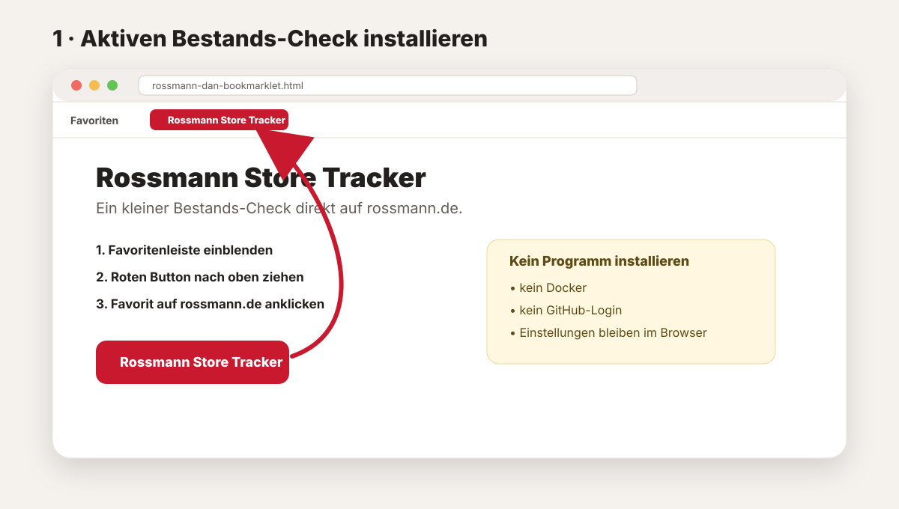
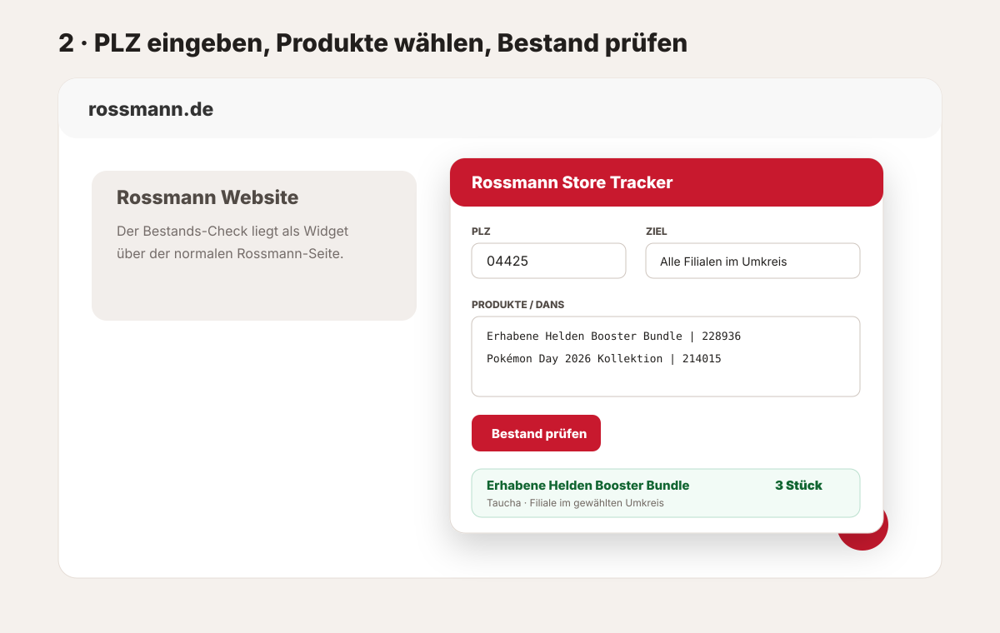

# ⚡ Aktiver Bestands-Check

Der **aktive Bestands-Check** ist der einfachste Einstieg in den Rossmann Store Tracker. Er eignet sich für spontane Prüfungen direkt im Browser und benötigt **keinen Docker-Container, keinen GitHub-Login und keine dauerhaft laufende Software**.

Technisch handelt es sich um ein **Bookmarklet**: ein Browser-Favorit, der auf `rossmann.de` ein kleines Bestands-Widget öffnet.

## Das brauchst du

- einen Desktop-Browser mit Favoriten-/Lesezeichenleiste,
- die Datei [`rossmann-dan-bookmarklet.html`](../rossmann-dan-bookmarklet.html),
- eine PLZ für das gewünschte Rossmann-Suchgebiet.

## 1. Bestands-Check installieren



1. Öffne [`rossmann-dan-bookmarklet.html`](../rossmann-dan-bookmarklet.html) auf GitHub.
2. Lade die Datei über **Download raw file** herunter und öffne sie lokal im Browser.
3. Blende die Favoriten-/Lesezeichenleiste ein.
   - **Safari:** `Darstellung → Favoritenleiste einblenden`
   - **Chrome / Edge:** `⌘⇧B` auf macOS bzw. `Strg+Umschalt+B` unter Windows
4. Ziehe den roten Button **Rossmann Store Tracker** in diese Leiste.

Damit ist die Installation abgeschlossen. Es wird kein Programm installiert.

> [!NOTE]
> Nach einem Update des Bookmarklets muss der bisherige Favorit durch den neu erzeugten ersetzt werden.

## 2. Bestands-Check öffnen

Öffne eine beliebige Seite auf `rossmann.de` und klicke auf den Favoriten **Rossmann Store Tracker**.

Wenn du den Favoriten auf einer anderen Website anklickst, öffnet das Bookmarklet zunächst `rossmann.de`. Klicke dort anschließend **noch einmal** auf den Favoriten.

Danach erscheint rechts unten das rote **DAN**-Widget.

## 3. Bestand prüfen



1. Trage deine **fünfstellige PLZ** ein.
2. Lass als Ziel **Alle Filialen im Umkreis** ausgewählt oder lade eine konkrete Filiale.
3. Prüfe die Produktliste. Eine Zeile besteht aus `Name | DAN`; alternativ genügt auch nur die DAN.
4. Klicke auf **Bestand prüfen**.

Der Check zeigt die von Rossmann gelieferten Filialen und die gemeldeten Bestände je Produkt an.

### Beispiel für eigene Produkte

```text
Erhabene Helden Booster Bundle | 228936
Pokémon Day 2026 Kollektion | 214015
228940
```

Die mitgelieferte Produktliste ist bereits vorbelegt und kann direkt verändert oder ergänzt werden.

## Eine bestimmte Filiale prüfen

Mit **Optionale Filialauswahl laden** fragt der Bestands-Check zunächst die von Rossmann zur PLZ gelieferten Filialen ab. Danach kannst du statt des gesamten Umkreises eine konkrete Filiale auswählen.

Die gespeicherte Filialauswahl wird beim nächsten Öffnen wieder angeboten.

## Was wird lokal gespeichert?

Diese Angaben liegen ausschließlich im Local Storage deines Browsers:

- PLZ,
- Produkt-/DAN-Liste,
- ausgewählte Filiale,
- zuletzt geladene Filialen.

Das Bookmarklet sendet diese Angaben nur an die Rossmann-Filialsuche, soweit sie für die angeforderte Bestandsprüfung benötigt werden. Es besitzt **keine Verbindung** zu einer Docker-Tracker-Installation.

## Häufige Fragen

### Der Favorit öffnet nur Rossmann, aber kein Widget

Das ist normal, wenn du ihn außerhalb von `rossmann.de` gestartet hast. Klicke den Favoriten auf der geöffneten Rossmann-Seite ein zweites Mal an.

### Ich sehe den roten Button nicht in meiner Favoritenleiste

Prüfe, ob die Favoriten-/Lesezeichenleiste eingeblendet ist. Öffne danach die lokale Installer-Datei erneut und ziehe den Button noch einmal in die Leiste.

### Muss der Bestands-Check dauerhaft laufen?

Nein. Er prüft nur dann aktiv, wenn du auf **Bestand prüfen** klickst.

### Ich möchte automatisch über Änderungen informiert werden

Dann ist der [🤖 automatische Docker-Tracker](docker-tracker.md) die passende Variante.
