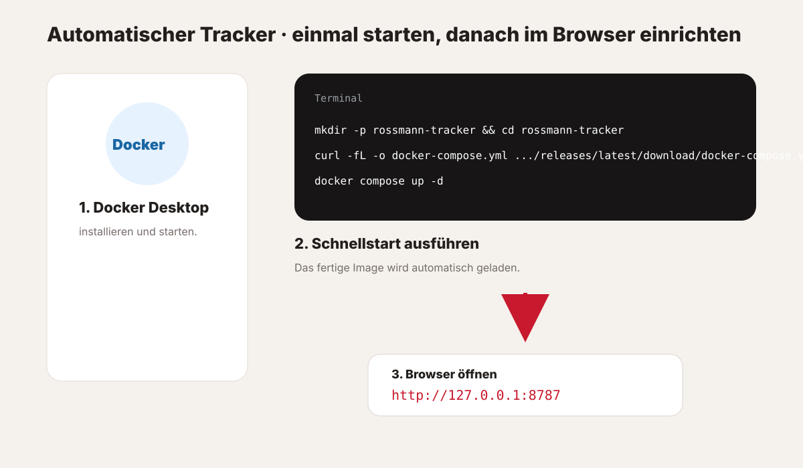
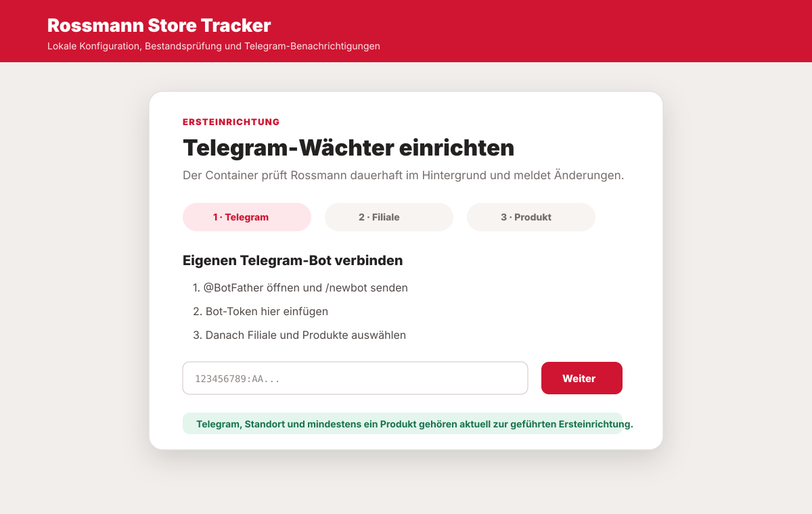

# 🤖 Automatischer Tracker

Der automatische **Rossmann Store Tracker** ist für die dauerhafte Überwachung gedacht. Er prüft ausgewählte Rossmann-Produkte und Filialen regelmäßig, speichert Bestandsänderungen lokal und meldet gewünschte Änderungen per Telegram.

Wenn du nur spontan nach einem Bestand schauen möchtest, starte stattdessen mit dem [⚡ aktiven Bestands-Check](bookmarklet.md).

## Das brauchst du

Für die empfohlene Installation benötigst du nur:

- **Docker Desktop** oder Docker Engine mit Docker Compose **2.24 oder neuer**,
- einen Browser für die lokale Weboberfläche,
- einen eigenen **Telegram-Bot** für die geführte Ersteinrichtung.

Git, Node.js und ein GitHub-Login sind für den normalen Release-Weg **nicht erforderlich**.

Das veröffentlichte Image unterstützt `linux/amd64` und `linux/arm64`.

## 1. Docker installieren und Tracker starten



Installiere und starte zunächst Docker Desktop. Öffne danach ein Terminal.

### macOS und Linux

```bash
mkdir -p rossmann-tracker
cd rossmann-tracker
curl -fL -o docker-compose.yml \
  https://github.com/Level42-dev/rossmann-tracker/releases/latest/download/docker-compose.yml
docker compose up -d
```

### Windows PowerShell

```powershell
New-Item -ItemType Directory -Force rossmann-tracker
Set-Location rossmann-tracker
Invoke-WebRequest -Uri "https://github.com/Level42-dev/rossmann-tracker/releases/latest/download/docker-compose.yml" -OutFile "docker-compose.yml"
docker compose up -d
```

Compose lädt das öffentliche Image `ghcr.io/level42-dev/rossmann-tracker:stable` automatisch. Ein separates `docker pull` ist nicht erforderlich.

## 2. Weboberfläche öffnen

Öffne anschließend im Browser:

<http://127.0.0.1:8787>

Der Dienst ist absichtlich nur an `127.0.0.1` gebunden und damit standardmäßig nur lokal auf dem Rechner erreichbar.

## 3. Geführte Ersteinrichtung



Die Weboberfläche führt eine frische Installation durch drei Schritte:

1. **Telegram verbinden**
2. **Suchgebiet oder konkrete Filiale auswählen**
3. **mindestens ein Produkt aus dem Katalog aktivieren**

### Telegram verbinden

1. Öffne **@BotFather** in Telegram.
2. Sende `/newbot`.
3. Vergib einen Namen und einen Benutzernamen für deinen Bot.
4. Kopiere den von BotFather ausgegebenen Bot-Token in die Weboberfläche.
5. Folge der angezeigten Kopplung, damit der Tracker deine Chat-ID erhält.

> [!IMPORTANT]
> In der aktuellen geführten Ersteinrichtung gehört Telegram zum Setup. Der Tracker wechselt erst ins vollständige Dashboard, wenn Telegram, Standort und mindestens ein Produkt eingerichtet sind.

Weitere Details stehen unter [Telegram](telegram.md).

### Filiale oder Suchgebiet wählen

Gib eine PLZ ein. Rossmann liefert dazu ein Suchgebiet mit mehreren Filialen. Du kannst entweder:

- **alle gelieferten Filialen im Umkreis** überwachen oder
- die Überwachung auf **eine konkrete Filiale** begrenzen.

### Produkte auswählen

Neue Installationen starten ohne aktive Produktauswahl. Wähle mindestens ein Produkt aus dem mitgelieferten Katalog aus. Produkte ohne bekannte DAN werden informativ angezeigt, können aber noch nicht überwacht werden.

## 4. Danach läuft der Tracker automatisch

Im Dashboard kannst du unter anderem:

- den aktuellen Tracker-Status ansehen,
- standardmäßig nur verfügbare Ergebnisse anzeigen,
- manuell **Jetzt prüfen** auslösen,
- das Tracking pausieren,
- Suchgebiete und Filialen ändern,
- Produkte aktivieren oder entfernen,
- Benachrichtigungsarten konfigurieren,
- Bestandsverläufe nach Filiale, Produkt und Zeitraum auswerten,
- Logs einsehen.

Automatische Prüfungen laufen frühestens alle **5 Minuten**. Einzelne Rossmann-Abfragen haben mindestens **2 Sekunden Abstand** plus Zufallsverzögerung.

## Persistente Daten

Die Compose-Datei bindet lokale Verzeichnisse ein:

- **`data/`** – Einstellungen, Telegram-Kopplung, letzter Zustand und Bestandsverlauf
- **`browser-data/`** – lokales Chromium-Profil für Rossmanns Client-Challenge

Beide Verzeichnisse sind von Git und vom Docker-Buildkontext ausgeschlossen und sollten nicht veröffentlicht oder ungeprüft an Fehlerberichte angehängt werden.

## Betrieb

```bash
docker compose ps
docker compose logs -f tracker
docker compose restart tracker
```

Der Container benötigt keinen Docker-Socket und keine weitreichenden Host-Rechte. Einstellungen werden über die lokale Weboberfläche geändert.

## Sicherung vor Updates

Vor einer Sicherung sollte der Container gestoppt werden. Die Compose-Dateien enthalten einen nur bei Bedarf gestarteten Sicherungsdienst ohne Netzwerkzugriff:

```bash
docker compose stop tracker
docker compose run --rm backup
docker compose start tracker
```

Der Snapshot wird mit Manifest unter `backups/` abgelegt. Schlägt der Sicherungslauf fehl, sollte das Update nicht fortgesetzt werden.

## Manuelles Update einer Release-Installation

```bash
docker compose config --quiet
docker compose stop tracker
docker compose run --rm backup
docker compose start tracker
docker compose pull
docker compose up -d
```

Das Release enthält zusätzlich `UPDATE.md` mit Vorprüfung und Rollbackablauf.

## Installation aus dem Quellcode

> [!NOTE]
> Dieser Weg ist für Entwicklung oder eigene lokale Builds gedacht, nicht für normale Nutzer.

```bash
git clone https://github.com/Level42-dev/rossmann-tracker.git
cd rossmann-tracker
docker compose up -d --build
docker compose logs -f tracker
```

Diese Variante baut das Image lokal über `build: .`. Sie ist vom Release-Weg getrennt; die beiden Compose-Dateien dürfen nicht miteinander vermischt werden.

## Manuelles Update einer Quellinstallation

```bash
git pull --ff-only
docker compose config --quiet
docker compose stop tracker
docker compose run --rm backup
docker compose up -d --build
```

Persistente Verzeichnisse bleiben bei beiden Wegen erhalten. Hinweise zu Versionstags, Rollback und Release-Artefakten stehen unter [Versionen und Releases](releases.md).

## Einmalige Namensumstellung

Private Entwicklungsinstallationen vor der Umbenennung verwendeten den festen Container-Namen **rossmann-dan-tracker**. Der öffentliche Name lautet **rossmann-store-tracker**.

Falls Docker beim ersten Aktualisieren beide Container meldet, den alten Compose-Stand zuerst mit `docker compose down` beenden und danach den aktuellen Stand neu starten. Die eingebundenen Verzeichnisse `data/` und `browser-data/` werden dadurch nicht gelöscht.
